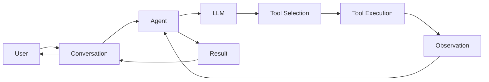

# Architecture

The OpenHands Software Agent SDK follows a modular, composable architecture that enables building production-ready AI agents for software engineering tasks.

## Core Components

The SDK is built around five primary components that work together to create functional AI agents:

<CardGroup cols={2}>
  <Card title="Agent" icon="robot">
    Orchestrates LLM interactions and tool execution
  </Card>
  <Card title="LLM" icon="brain">
    Handles communication with language models
  </Card>
  <Card title="Conversation" icon="comments">
    Manages message flow and agent lifecycle
  </Card>
  <Card title="Tool" icon="wrench">
    Provides capabilities for agents to act
  </Card>
  <Card title="Workspace" icon="folder">
    Defines the execution environment
  </Card>
</CardGroup>

## Component Architecture

### Agent

**Location**: `openhands-sdk/openhands/sdk/agent/`

The `Agent` is the central component that orchestrates LLM interactions and tool execution.

```python
from openhands.sdk import Agent, LLM, Tool
from openhands.tools.terminal import TerminalTool

agent = Agent(
    llm=llm,                    # LLM configuration
    tools=[                     # Available tools
        Tool(name=TerminalTool.name)
    ],
    max_iterations=100,         # Maximum conversation steps
    system_message="Custom instructions"  # Optional system prompt
)
```

**Key Responsibilities**:
- Maintain agent state and configuration
- Route tool calls to appropriate handlers
- Enforce execution limits (max_iterations)
- Apply system-level prompts and constraints

**Agent Types**:
- `Agent`: Standard agent with LLM + tools
- `ACPAgent`: Agent Client Protocol compliant agent (lazy-loaded)
- `AgentBase`: Base class for custom agent implementations

**File References**:
- Main implementation: `openhands-sdk/openhands/sdk/agent/agent.py`
- Base class: `openhands-sdk/openhands/sdk/agent/base.py`
- ACP agent: `openhands-sdk/openhands/sdk/agent/acp_agent.py`

### LLM

**Location**: `openhands-sdk/openhands/sdk/llm/`

The `LLM` component manages communication with language models via LiteLLM.

```python
from openhands.sdk import LLM

llm = LLM(
    model="anthropic/claude-sonnet-4-5-20250929",
    api_key="your-api-key",
    base_url=None,              # Optional custom endpoint
    temperature=0.0,            # Sampling temperature
    top_p=1.0,                  # Nucleus sampling
    max_tokens=4096,            # Max response length
)
```

**Supported Features**:
- **Multi-provider support**: Anthropic, OpenAI, AWS Bedrock, Azure, local models
- **Function calling**: Native and non-native function calling support
- **Streaming**: Token-level streaming with callbacks
- **Fallback strategies**: Automatic fallback to alternative models
- **Retry logic**: Configurable retry with exponential backoff
- **Metrics & telemetry**: Built-in observability (Laminar integration)

**Key Modules**:
- `llm.py`: Main LLM class
- `message.py`: Message types (TextContent, ImageContent, ThinkingBlock)
- `llm_response.py`: Response handling
- `streaming.py`: Streaming support
- `llm_registry.py`: Model registry and management
- `auth/`: Authentication providers
- `exceptions/`: Error handling and classification
- `utils/`: Model info, features, and utilities

**File References**:
- Core: `openhands-sdk/openhands/sdk/llm/llm.py`
- Registry: `openhands-sdk/openhands/sdk/llm/llm_registry.py`
- Messages: `openhands-sdk/openhands/sdk/llm/message.py`

### Conversation

**Location**: `openhands-sdk/openhands/sdk/conversation/`

The `Conversation` manages the message flow and agent execution lifecycle.

```python
from openhands.sdk import Conversation, Agent

conversation = Conversation(
    agent=agent,                # Agent configuration
    workspace="/path/to/workspace",  # Local workspace
    persistence_dir=None,       # Optional persistence
    plugins=[],                 # Optional plugins
)

# Send messages and run the agent
conversation.send_message("Write a README for this project")
conversation.run()
```

**Conversation Types**:

| Type | Description | Use Case |
|------|-------------|----------|
| `Conversation` | Auto-detects local/remote based on workspace | Default choice |
| `LocalConversation` | Runs agent in current process | Development, debugging |
| `RemoteConversation` | Connects to Agent Server via WebSocket | Production, sandboxing |

**Key Features**:
- **Message management**: Send, receive, and persist messages
- **Event streaming**: Real-time event notifications
- **State persistence**: Save/restore conversation state
- **Plugins**: Extend functionality with plugins
- **Callbacks**: Custom handlers for conversation events
- **Context management**: Automatic context window management

**File References**:
- Main: `openhands-sdk/openhands/sdk/conversation/conversation.py`
- Local: `openhands-sdk/openhands/sdk/conversation/local_conversation.py`
- Remote: `openhands-sdk/openhands/sdk/conversation/remote_conversation.py`
- Base: `openhands-sdk/openhands/sdk/conversation/base.py`

### Tool

**Location**: 
- SDK: `openhands-sdk/openhands/sdk/tool/`
- Built-in tools: `openhands-tools/openhands/tools/`

Tools provide capabilities for agents to interact with their environment.

```python
from openhands.sdk import Tool
from openhands.tools.terminal import TerminalTool
from openhands.tools.file_editor import FileEditorTool

# Use built-in tools
tools = [
    Tool(name=TerminalTool.name),
    Tool(name=FileEditorTool.name),
]

# Register custom tool
from openhands.sdk import register_tool, ToolDefinition

@register_tool
def my_custom_tool(param: str) -> str:
    """Custom tool description"""
    return f"Processed: {param}"
```

**Built-in Tools**:

| Tool | Description | Location |
|------|-------------|----------|
| `TerminalTool` | Execute shell commands | `openhands-tools/openhands/tools/terminal/` |
| `FileEditorTool` | Read, write, edit files | `openhands-tools/openhands/tools/file_editor/` |
| `TaskTrackerTool` | Track tasks and progress | `openhands-tools/openhands/tools/task_tracker/` |
| `BrowserUseTool` | Browser automation | `openhands-tools/openhands/tools/browser_use/` |
| `DelegateTool` | Delegate to sub-agents | `openhands-tools/openhands/tools/delegate/` |
| `ApplyPatchTool` | Apply git patches | `openhands-tools/openhands/tools/apply_patch/` |
| `GrepTool` | Search file contents | `openhands-tools/openhands/tools/grep/` |
| `GlobTool` | File pattern matching | `openhands-tools/openhands/tools/glob/` |

**Tool Components**:
- `ToolDefinition`: Schema defining tool interface
- `Action`: Tool invocation request
- `Observation`: Tool execution result

**File References**:
- Tool base: `openhands-sdk/openhands/sdk/tool/tool.py`
- Tool definition: `openhands-sdk/openhands/sdk/tool/tool_definition.py`
- Action/Observation: `openhands-sdk/openhands/sdk/tool/action.py`, `observation.py`

### Workspace

**Location**: 
- SDK: `openhands-sdk/openhands/sdk/workspace/`
- Implementations: `openhands-workspace/openhands/workspace/`

Workspaces define where and how agent code executes.

```python
from openhands.sdk import LocalWorkspace, RemoteWorkspace

# Local workspace (current directory)
workspace = LocalWorkspace("/path/to/project")

# Remote workspace (Docker container)
workspace = RemoteWorkspace(
    workspace_id="my-workspace",
    base_url="http://localhost:8000"
)
```

**Workspace Types**:

| Type | Description | Use Case |
|------|-------------|----------|
| `LocalWorkspace` | Local filesystem access | Development, testing |
| `RemoteWorkspace` | Connects to Agent Server | Production, isolation |
| `DockerWorkspace` | Docker container execution | Sandboxing, reproducibility |

**File References**:
- Base: `openhands-sdk/openhands/sdk/workspace/workspace.py`
- Local: `openhands-sdk/openhands/sdk/workspace/local_workspace.py`
- Remote: `openhands-sdk/openhands/sdk/workspace/remote_workspace.py`
- Docker: `openhands-workspace/openhands/workspace/docker_workspace.py`

## Package Architecture

The SDK is organized as a UV monorepo with four distributable packages:

```
software-agent-sdk/
├── openhands-sdk/              # Core SDK
│   └── openhands/sdk/
│       ├── agent/              # Agent implementations
│       ├── llm/                # LLM communication
│       ├── conversation/       # Conversation management
│       ├── tool/               # Tool framework
│       ├── workspace/          # Workspace abstractions
│       ├── event/              # Event system
│       ├── context/            # Context management
│       ├── hooks/              # Lifecycle hooks
│       ├── mcp/                # MCP integration
│       ├── plugin/             # Plugin system
│       ├── skills/             # Skills framework
│       ├── subagent/           # Sub-agent management
│       └── utils/              # Utilities
├── openhands-tools/            # Built-in tools
│   └── openhands/tools/
│       ├── terminal/           # Shell execution
│       ├── file_editor/        # File operations
│       ├── task_tracker/       # Task management
│       ├── browser_use/        # Browser automation
│       ├── delegate/           # Agent delegation
│       └── ...
├── openhands-workspace/        # Workspace implementations
│   └── openhands/workspace/
│       ├── docker_workspace.py
│       ├── k8s_workspace.py
│       └── ...
└── openhands-agent-server/     # REST/WebSocket API
    └── openhands/agent_server/
        ├── api.py              # FastAPI app
        ├── conversation_router.py
        ├── event_router.py
        ├── sockets.py          # WebSocket handling
        └── ...
```

## Data Flow

### Typical Execution Flow



1. **User sends message** → `Conversation.send_message()`
2. **Conversation** → Creates event, adds to queue
3. **Agent** → Processes event, calls LLM
4. **LLM** → Returns tool calls or final response
5. **Tool execution** → Agent executes tools via workspace
6. **Observation** → Tool results sent back to LLM
7. **Iteration** → Repeat until completion or max_iterations
8. **Result** → Final response returned to user

## Event System

**Location**: `openhands-sdk/openhands/sdk/event/`

Events are the fundamental communication unit in the SDK.

**Event Types**:
- `MessageEvent`: User or agent messages
- `ActionEvent`: Tool invocations
- `ObservationEvent`: Tool results
- `AgentStateEvent`: Agent state changes
- `ErrorEvent`: Error conditions
- `HookExecutionEvent`: Hook lifecycle events

**File References**:
- Event base: `openhands-sdk/openhands/sdk/event/event.py`
- LLM events: `openhands-sdk/openhands/sdk/event/llm_convertible.py`

## Advanced Features

### Skills & Plugins

**Location**: `openhands-sdk/openhands/sdk/skills/`, `plugin/`

Skills are reusable agent capabilities defined in markdown files.

```python
from openhands.sdk import load_project_skills, load_user_skills

# Load skills from .openhands/skills/ directory
skills = load_project_skills()

# Load skills from ~/.openhands/skills/
user_skills = load_user_skills()

# Use in conversation
conversation = Conversation(agent=agent, workspace=workspace)
conversation.context.add_skills(skills)
```

**File References**:
- Skills: `openhands-sdk/openhands/sdk/skills/`
- Plugins: `openhands-sdk/openhands/sdk/plugin/`

### Sub-agents

**Location**: `openhands-sdk/openhands/sdk/subagent/`

Sub-agents enable hierarchical agent architectures.

```python
from openhands.sdk import register_agent, load_project_agents

# Register custom sub-agent
register_agent("my_agent", agent_factory_fn)

# Load from .openhands/agents/ directory
agents = load_project_agents()
```

**File References**:
- Sub-agent registry: `openhands-sdk/openhands/sdk/subagent/registry.py`
- Loader: `openhands-sdk/openhands/sdk/subagent/loader.py`

### MCP Integration

**Location**: `openhands-sdk/openhands/sdk/mcp/`

Model Context Protocol support for extending capabilities.

```python
from openhands.sdk import MCPClient, create_mcp_tools

# Connect to MCP server
mcp_client = MCPClient(server_url="http://localhost:3000")
tools = await create_mcp_tools(mcp_client)

# Use MCP tools in agent
agent = Agent(llm=llm, tools=tools)
```

**File References**:
- MCP client: `openhands-sdk/openhands/sdk/mcp/client.py`
- MCP tools: `openhands-sdk/openhands/sdk/mcp/tools.py`

### Context Management

**Location**: `openhands-sdk/openhands/sdk/context/`

Manages conversation context and token limits.

```python
from openhands.sdk import AgentContext, LLMSummarizingCondenser

context = AgentContext(
    max_tokens=100000,          # Max context size
    condenser=LLMSummarizingCondenser(llm=llm)
)
```

**Features**:
- Automatic context window management
- LLM-based summarization
- Event history compression

**File References**:
- Context: `openhands-sdk/openhands/sdk/context/context.py`
- Condenser: `openhands-sdk/openhands/sdk/context/condenser.py`

## Agent Server Architecture

**Location**: `openhands-agent-server/openhands/agent_server/`

The Agent Server provides a REST/WebSocket API for remote agent control.

**Components**:
- **API Layer** (`api.py`): FastAPI application
- **Routers**: Conversation, Event, File, Git, Skills, Tools
- **Services**: Business logic for each domain
- **WebSocket** (`sockets.py`): Real-time event streaming
- **Storage**: SQLite + JSONL event storage

**API Endpoints**:
- `POST /conversations`: Create conversation
- `GET /conversations/{id}`: Get conversation
- `POST /conversations/{id}/events`: Send message
- `WS /conversations/{id}/events/socket`: WebSocket stream

**File References**:
- Main API: `openhands-agent-server/openhands/agent_server/api.py`
- Conversation service: `conversation_service.py`
- WebSocket: `sockets.py`

## Security & Isolation

### Security Policies

**Location**: `openhands-sdk/openhands/sdk/security/`

The SDK includes configurable security policies for tool execution.

```python
from openhands.sdk.security import SecurityPolicy

policy = SecurityPolicy(
    allow_file_access=["/workspace"],
    deny_commands=["rm -rf /", "sudo"],
    require_confirmation=["git push", "npm publish"]
)

agent = Agent(llm=llm, tools=tools, security_policy=policy)
```

**File References**:
- Security: `openhands-sdk/openhands/sdk/security/`

### Workspace Isolation

Remote workspaces provide isolation:
- **Docker**: Containerized execution
- **Kubernetes**: Pod-based isolation
- **API**: Network-isolated remote execution

## Extension Points

The SDK is designed for extensibility:

1. **Custom Tools**: Implement `ToolDefinition` interface
2. **Custom Agents**: Extend `AgentBase`
3. **Custom Workspaces**: Implement `Workspace` interface
4. **Plugins**: Create plugin classes
5. **Hooks**: Register lifecycle hooks
6. **Skills**: Define markdown-based skills
7. **Condensers**: Custom context compression

## Next Steps

<CardGroup cols={2}>
  <Card title="Usage Guide" icon="code" href="/docs/usage">
    See practical examples and patterns
  </Card>
  <Card title="API Reference" icon="book" href="/docs/api">
    Detailed API documentation
  </Card>
  <Card title="Examples" icon="flask" href="https://github.com/OpenHands/software-agent-sdk/tree/main/examples">
    Browse example code
  </Card>
  <Card title="Contributing" icon="code-pull-request" href="https://github.com/OpenHands/software-agent-sdk/blob/main/DEVELOPMENT.md">
    Development guide
  </Card>
</CardGroup>
