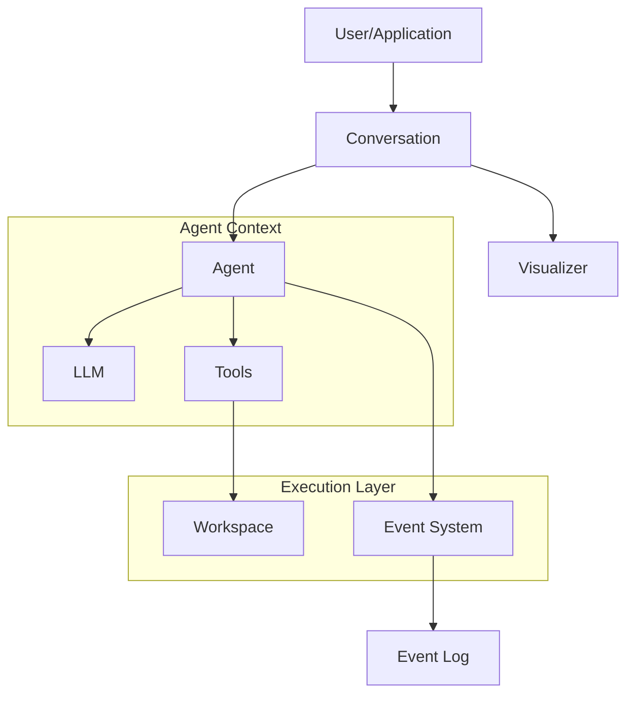
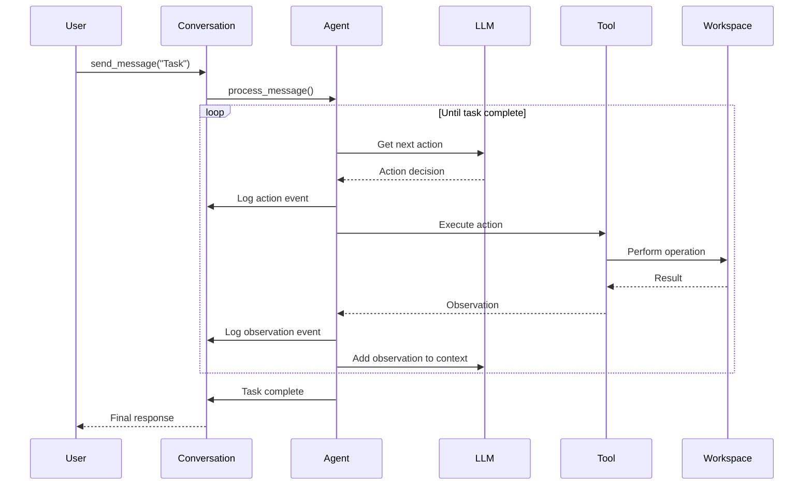

## Overview

The OpenHands SDK is built on a modular, event-driven architecture that separates concerns and enables flexible agent design. Understanding these core concepts will help you build powerful agents.

## Core Architecture Diagram



## Core Components

### 1. Agent

**Location**: `openhands-sdk/openhands/sdk/agent/`

The Agent is the core intelligence component that orchestrates task execution.

#### Agent Types

<Tabs>
  <Tab title="Standard Agent">
    **File**: `openhands-sdk/openhands/sdk/agent/agent.py`
    
    The default agent implementation that follows a reasoning-action loop:
    1. Receives user message
    2. Analyzes context and available tools
    3. Decides on actions to take
    4. Executes actions via tools
    5. Observes results
    6. Repeats until task is complete
    
    ```python
    from openhands.sdk import Agent, LLM, Tool
    from openhands.tools.terminal import TerminalTool
    
    agent = Agent(
        llm=LLM(model="anthropic/claude-sonnet-4-5-20250929"),
        tools=[Tool(name=TerminalTool.name)],
        system_message="You are a helpful coding assistant.",
    )
    ```
  </Tab>
  
  <Tab title="ACP Agent">
    **File**: `openhands-sdk/openhands/sdk/agent/acp_agent.py`
    
    An agent implementation that follows the Agent Communication Protocol (ACP) for standardized agent-to-agent communication.
    
    ```python
    from openhands.sdk.agent import ACPAgent
    
    agent = ACPAgent(
        llm=llm,
        # ACP-specific configuration
    )
    ```
  </Tab>
  
  <Tab title="Custom Agent">
    **Base Class**: `openhands-sdk/openhands/sdk/agent/base.py`
    
    Create custom agents by extending `AgentBase`:
    
    ```python
    from openhands.sdk import AgentBase
    
    class MyCustomAgent(AgentBase):
        def process_action(self, action):
            # Custom action processing logic
            pass
    ```
  </Tab>
</Tabs>

#### Key Agent Properties

- **LLM**: The language model powering the agent's intelligence
- **Tools**: Available tools the agent can use
- **System Message**: Instructions defining the agent's role and behavior
- **Context**: Conversation history and working memory
- **Hooks**: Extension points for modifying agent behavior

### 2. Conversation

**Location**: `openhands-sdk/openhands/sdk/conversation/`

The Conversation manages the execution flow and state of agent interactions.

#### Conversation Types

<CardGroup cols={2}>
  <Card title="Local Conversation" icon="computer">
    **File**: `openhands-sdk/openhands/sdk/conversation/impl/local_conversation.py`
    
    Runs the agent in the current process with direct access to the local filesystem.
    
    ```python
    from openhands.sdk import LocalConversation
    
    conversation = LocalConversation(
        agent=agent,
        workspace="/path/to/workspace"
    )
    ```
  </Card>
  
  <Card title="Remote Conversation" icon="server">
    **File**: `openhands-sdk/openhands/sdk/conversation/impl/remote_conversation.py`
    
    Connects to a remote agent server via WebSocket, running the agent in an isolated environment.
    
    ```python
    from openhands.sdk import RemoteConversation
    
    conversation = RemoteConversation(
        agent=agent,
        server_url="ws://localhost:8000"
    )
    ```
  </Card>
</CardGroup>

#### Conversation Lifecycle

```python
# 1. Create conversation
conversation = Conversation(agent=agent, workspace=workspace)

# 2. Send initial message
conversation.send_message("Analyze this codebase and suggest improvements")

# 3. Run agent (executes reasoning-action loop)
conversation.run()

# 4. Access results
final_response = conversation.get_final_response()
stats = conversation.stats  # Token usage, cost, etc.

# 5. Continue conversation
conversation.send_message("Now implement the first suggestion")
conversation.run()
```

#### Conversation State

**File**: `openhands-sdk/openhands/sdk/conversation/state.py`

Tracks execution status:

```python
from openhands.sdk import ConversationExecutionStatus

# Possible states:
# - IDLE: Waiting for user input
# - RUNNING: Agent is actively processing
# - PAUSED: Execution paused (e.g., waiting for confirmation)
# - STOPPED: Execution stopped by user or error
# - COMPLETED: Task completed successfully
```

### 3. LLM (Language Model)

**Location**: `openhands-sdk/openhands/sdk/llm/`

The LLM component provides a unified interface for interacting with various language model providers.

#### Key Features

<AccordionGroup>
  <Accordion title="Multi-Provider Support">
    **File**: `openhands-sdk/openhands/sdk/llm/llm.py`
    
    Built on LiteLLM, supporting 100+ models:
    - OpenAI (GPT-4, GPT-3.5)
    - Anthropic (Claude)
    - Google (Gemini)
    - Azure OpenAI
    - Open-source models (via Ollama, vLLM, etc.)
    
    ```python
    from openhands.sdk import LLM
    
    # Different providers
    llm_openai = LLM(model="openai/gpt-4")
    llm_anthropic = LLM(model="anthropic/claude-3-opus-20240229")
    llm_gemini = LLM(model="gemini/gemini-pro")
    ```
  </Accordion>
  
  <Accordion title="Function Calling">
    **Files**: 
    - `openhands-sdk/openhands/sdk/llm/mixins/fn_call_converter.py`
    - `openhands-sdk/openhands/sdk/llm/mixins/non_native_fc.py`
    
    Automatic function calling support with fallback for models that don't support it natively.
  </Accordion>
  
  <Accordion title="Streaming">
    **File**: `openhands-sdk/openhands/sdk/llm/llm.py`
    
    Stream responses token-by-token:
    
    ```python
    for chunk in llm.stream("Write a poem"):
        print(chunk.delta, end="")
    ```
  </Accordion>
  
  <Accordion title="Retry & Fallback">
    **Files**:
    - `openhands-sdk/openhands/sdk/llm/utils/retry_mixin.py`
    - `openhands-sdk/openhands/sdk/llm/llm.py` (FallbackStrategy)
    
    Automatic retries with exponential backoff and fallback to alternative models.
    
    ```python
    llm = LLM(
        model="openai/gpt-4",
        fallback_strategy=FallbackStrategy.FALLBACK_ON_ERROR,
        fallback_models=["openai/gpt-3.5-turbo"]
    )
    ```
  </Accordion>
  
  <Accordion title="Authentication">
    **File**: `openhands-sdk/openhands/sdk/llm/auth/`
    
    Support for various authentication methods including OAuth, API keys, and custom credentials.
  </Accordion>
</AccordionGroup>

#### Message Format

**File**: `openhands-sdk/openhands/sdk/llm/message.py`

```python
from openhands.sdk import Message, TextContent, ImageContent

# Text message
msg = Message(
    role="user",
    content=[TextContent(text="Hello!")]
)

# Message with image
msg_with_image = Message(
    role="user",
    content=[
        TextContent(text="What's in this image?"),
        ImageContent(image="base64_encoded_image_data")
    ]
)
```

### 4. Tools

**Location**: `openhands-sdk/openhands/sdk/tool/` (framework) and `openhands-tools/openhands/tools/` (implementations)

Tools extend agent capabilities by providing specific functions the agent can execute.

#### Tool Architecture

```python
from openhands.sdk import Tool, register_tool, Action, Observation

# Using built-in tools
from openhands.tools.terminal import TerminalTool
from openhands.tools.file_editor import FileEditorTool

tools = [
    Tool(name=TerminalTool.name),
    Tool(name=FileEditorTool.name),
]
```

#### Creating Custom Tools

**Framework**: `openhands-sdk/openhands/sdk/tool/`

```python
from openhands.sdk import register_tool, Action, Observation
from pydantic import BaseModel

class MyAction(Action):
    name: str = "my_custom_tool"
    parameter: str

class MyObservation(Observation):
    result: str

@register_tool(name="my_custom_tool")
class MyCustomTool:
    def execute(self, action: MyAction) -> MyObservation:
        # Tool implementation
        result = f"Processed: {action.parameter}"
        return MyObservation(result=result)
```

#### Built-in Tools

<CardGroup cols={2}>
  <Card title="File Editor" icon="file-code">
    **Location**: `openhands-tools/openhands/tools/file_editor/`
    
    Advanced file manipulation with operations like view, create, edit, search & replace.
  </Card>
  
  <Card title="Terminal" icon="terminal">
    **Location**: `openhands-tools/openhands/tools/terminal/`
    
    Execute shell commands with output capture and timeout support.
  </Card>
  
  <Card title="Task Tracker" icon="list-check">
    **Location**: `openhands-tools/openhands/tools/task_tracker/`
    
    Track and manage multi-step tasks with status updates.
  </Card>
  
  <Card title="Browser Use" icon="browser">
    **Location**: `openhands-tools/openhands/tools/browser_use/`
    
    Web browsing capabilities for information gathering.
  </Card>
  
  <Card title="Delegate" icon="users">
    **Location**: `openhands-tools/openhands/tools/delegate/`
    
    Delegate subtasks to specialized sub-agents.
  </Card>
  
  <Card title="Apply Patch" icon="file-code">
    **Location**: `openhands-tools/openhands/tools/apply_patch/`
    
    Apply unified diff patches to files.
  </Card>
</CardGroup>

### 5. Events

**Location**: `openhands-sdk/openhands/sdk/event/`

The event system provides a structured way to track all agent actions and observations.

#### Event Types

<Tabs>
  <Tab title="Action Events">
    Events representing actions the agent wants to perform.
    
    Examples:
    - `TerminalAction` - Execute a shell command
    - `FileEditorAction` - Edit a file
    - `MessageEvent` - Send a message to the user
    
    **Base**: `openhands.sdk.event.Action`
  </Tab>
  
  <Tab title="Observation Events">
    Events representing results of actions or external inputs.
    
    Examples:
    - `TerminalObservation` - Output from shell command
    - `FileEditorObservation` - Result of file operation
    - `MessageEvent` - User message
    
    **Base**: `openhands.sdk.event.Observation`
  </Tab>
  
  <Tab title="System Events">
    Events for system-level operations.
    
    Examples:
    - `HookExecutionEvent` - Hook was triggered
    - Internal state changes
    
    **Base**: `openhands.sdk.event.Event`
  </Tab>
</Tabs>

#### Event Log

**File**: `openhands-sdk/openhands/sdk/conversation/event_store.py`

All events are stored in an event log, enabling:

- **Persistence**: Save and restore conversation state
- **Replay**: Re-run conversations for debugging
- **Audit**: Track all agent actions
- **Analysis**: Analyze agent behavior patterns

```python
# Access event log
events = conversation.event_log.events

for event in events:
    print(f"{event.timestamp}: {event.__class__.__name__}")
```

### 6. Workspace

**Location**: `openhands-sdk/openhands/sdk/workspace/` and `openhands-workspace/`

The workspace provides the execution environment for agent operations.

#### Workspace Types

<Tabs>
  <Tab title="Local Workspace">
    **File**: `openhands-sdk/openhands/sdk/workspace/local_workspace.py`
    
    Direct access to local filesystem:
    
    ```python
    from openhands.sdk import LocalWorkspace
    
    workspace = LocalWorkspace(path="/path/to/project")
    ```
    
    **Use Cases**:
    - Development and testing
    - Working on local projects
    - Quick prototyping
  </Tab>
  
  <Tab title="Remote Workspace">
    **File**: `openhands-sdk/openhands/sdk/workspace/remote_workspace.py`
    
    Isolated workspace in Docker/Kubernetes:
    
    ```python
    from openhands.sdk import RemoteWorkspace
    
    workspace = RemoteWorkspace(
        server_url="http://agent-server:8000",
        workspace_id="unique-workspace-id"
    )
    ```
    
    **Use Cases**:
    - Production deployments
    - Untrusted code execution
    - Scalable multi-tenant systems
    - CI/CD pipelines
  </Tab>
</Tabs>

#### Workspace Operations

Workspaces provide a consistent interface:

```python
# Read file
content = workspace.read_file("path/to/file.py")

# Write file
workspace.write_file("path/to/file.py", "content")

# List files
files = workspace.list_files("src/")

# Execute command (in some workspace types)
result = workspace.execute_command("ls -la")
```

### 7. Context & Memory

**Location**: `openhands-sdk/openhands/sdk/context/`

Agent context manages conversation history and working memory.

#### AgentContext

**File**: `openhands-sdk/openhands/sdk/context/agent_context.py`

```python
from openhands.sdk import AgentContext

context = AgentContext(
    max_history_length=100,  # Keep last 100 events
    condensing_strategy=None,  # Or use LLMSummarizingCondenser
)
```

#### Context Condensing

**File**: `openhands-sdk/openhands/sdk/context/condenser.py`

For long conversations, context can be condensed to stay within LLM token limits:

```python
from openhands.sdk import LLMSummarizingCondenser

condenser = LLMSummarizingCondenser(
    llm=llm,
    target_size=5000,  # tokens
)

context = AgentContext(condensing_strategy=condenser)
```

### 8. Skills & Plugins

#### Skills

**Location**: `openhands-sdk/openhands/sdk/skills/`

Skills are reusable agent instructions loaded from markdown files:

```python
from openhands.sdk import load_project_skills, load_user_skills

# Load from .openhands_skills/ in project
project_skills = load_project_skills()

# Load from ~/.openhands/skills/
user_skills = load_user_skills()

# Use in agent
agent = Agent(
    llm=llm,
    tools=tools,
    skills=project_skills,
)
```

**Format**: Skills are markdown files with frontmatter:

```markdown
---
name: python-testing
description: Guidelines for writing Python tests
---

When writing tests:
1. Use pytest framework
2. Follow naming convention test_*.py
3. Use fixtures for setup/teardown
```

#### Plugins

**Location**: `openhands-sdk/openhands/sdk/plugin/`

Plugins extend agent functionality at runtime:

```python
from openhands.sdk import Plugin

class MyPlugin(Plugin):
    def on_action(self, action):
        # Called before every action
        pass
    
    def on_observation(self, observation):
        # Called after every observation
        pass
```

### 9. MCP Integration

**Location**: `openhands-sdk/openhands/sdk/mcp/`

Model Context Protocol (MCP) integration for external tool providers:

```python
from openhands.sdk import MCPClient, create_mcp_tools

# Connect to MCP server
mcp_client = MCPClient(server_url="http://mcp-server:8000")

# Create tools from MCP server
mcp_tools = create_mcp_tools(mcp_client)

# Use in agent
agent = Agent(llm=llm, tools=mcp_tools)
```

**Files**:
- `openhands-sdk/openhands/sdk/mcp/client.py` - MCP client implementation
- `openhands-sdk/openhands/sdk/mcp/tool.py` - MCP tool definitions

### 10. Hooks System

**Location**: `openhands-sdk/openhands/sdk/hooks/`

Hooks provide extension points to modify agent behavior:

```python
from openhands.sdk.hooks import Hook

class CustomHook(Hook):
    def before_action(self, action):
        # Modify or log action before execution
        return action
    
    def after_observation(self, observation):
        # Process observation after execution
        return observation

agent = Agent(
    llm=llm,
    tools=tools,
    hooks=[CustomHook()],
)
```

## Agent Execution Flow

Understanding the complete execution flow helps debug and optimize agents:



### Step-by-Step Flow

1. **User Message**: User sends a message via `conversation.send_message()`
2. **Message Processing**: Conversation passes message to agent
3. **Reasoning**: Agent sends context to LLM to decide next action
4. **Action Selection**: LLM returns structured action (tool call)
5. **Action Execution**: Agent executes action via appropriate tool
6. **Workspace Interaction**: Tool performs operations on workspace
7. **Observation**: Tool returns observation with results
8. **Context Update**: Observation added to agent's context
9. **Loop**: Steps 3-8 repeat until task is complete
10. **Completion**: Agent signals completion, returns final response

## Advanced Architecture Patterns

### Multi-Agent Systems

**File**: `openhands-sdk/openhands/sdk/subagent/`

Create specialized sub-agents for complex tasks:

```python
from openhands.sdk import register_agent, Agent

# Define specialized agent
@register_agent(name="code_reviewer")
def create_reviewer_agent(llm):
    return Agent(
        llm=llm,
        system_message="You are a code review specialist.",
        tools=[FileEditorTool, ...],
    )

# Main agent can delegate to reviewer
# Using delegate tool: openhands-tools/openhands/tools/delegate/
```

### Confirmation Mode

**File**: `openhands-sdk/openhands/sdk/conversation/conversation.py`

Require human approval for sensitive operations:

```python
conversation = Conversation(
    agent=agent,
    workspace=workspace,
    confirmation_mode=True,  # Agent asks before executing
)

# Implement callback to approve/reject
def confirm_action(action):
    return input(f"Execute {action}? (y/n): ") == "y"

conversation.set_confirmation_callback(confirm_action)
```

### Observability

**Location**: `openhands-sdk/openhands/sdk/observability/`

Built-in observability with Laminar:

```python
# Set environment variable
os.environ["LMNR_PROJECT_API_KEY"] = "your-key"

# Conversations are automatically traced
conversation = Conversation(agent=agent)
# All LLM calls and events are sent to Laminar
```

### Security Policies

**Location**: `openhands-sdk/openhands/sdk/security/`

Control what agents can and cannot do:

```python
from openhands.sdk.security import SecurityPolicy

policy = SecurityPolicy(
    allow_network=False,
    allow_file_write=True,
    allowed_paths=["/safe/path"],
)

agent = Agent(llm=llm, tools=tools, security_policy=policy)
```

## Best Practices

<AccordionGroup>
  <Accordion title="Tool Selection">
    - Start with minimal tools, add as needed
    - Use specialized tools over general ones
    - Consider creating custom tools for domain-specific tasks
    - Tools are in `openhands-tools/openhands/tools/`
  </Accordion>
  
  <Accordion title="Context Management">
    - Use context condensing for long conversations
    - Implement `LLMSummarizingCondenser` for automatic summarization
    - Monitor token usage via `conversation.stats`
    - Configuration in `openhands-sdk/openhands/sdk/context/`
  </Accordion>
  
  <Accordion title="Error Handling">
    - Implement proper error callbacks
    - Use try-except around `conversation.run()`
    - Monitor conversation status
    - Check event log for failures
  </Accordion>
  
  <Accordion title="Performance">
    - Use streaming for long-running tasks
    - Implement callbacks for progress updates
    - Consider async execution for multiple agents
    - Profile using observability tools
  </Accordion>
  
  <Accordion title="Testing">
    - Test agents with different LLMs
    - Use local workspace for testing
    - Mock external services
    - Test suite in `tests/` directory
  </Accordion>
</AccordionGroup>

## Next Steps

<CardGroup cols={2}>
  <Card title="Usage Examples" icon="code" href="/docs/usage">
    See practical examples of using these concepts
  </Card>
  <Card title="API Reference" icon="book" href="/docs/api">
    Detailed API documentation for all components
  </Card>
</CardGroup>
